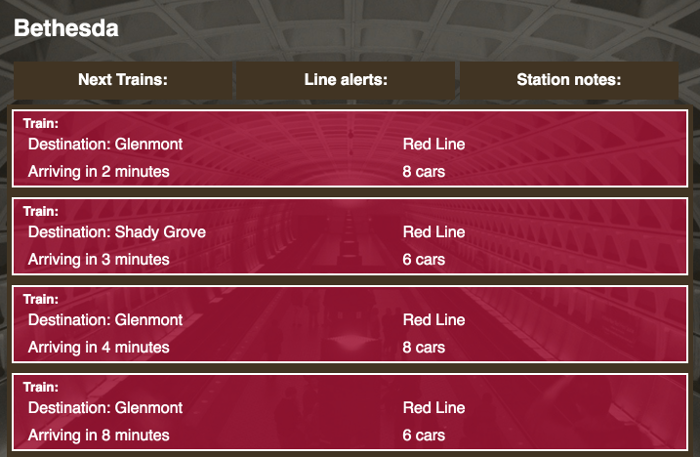
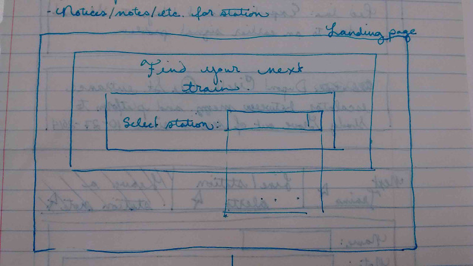
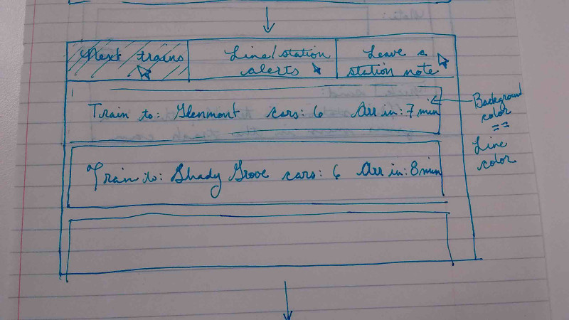
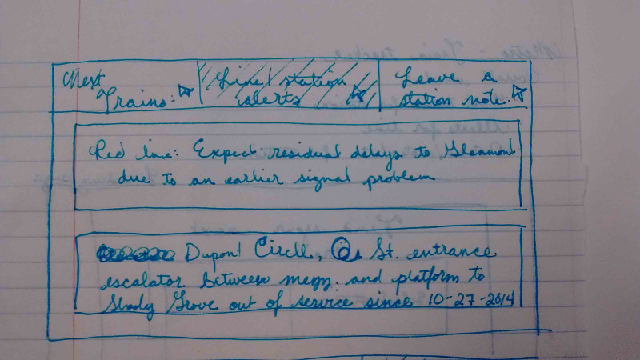
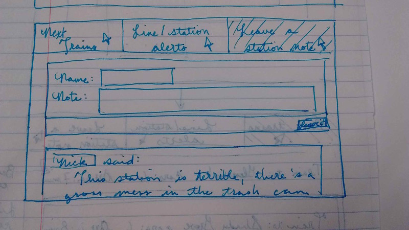

DC Train Tracker
----------------

### Overview

Screenshot from app:

This app uses AngularJS to pull information on the DC Metro system and make it accessible to users. It also has a Ruby on Rails backend (https://github.com/marygriffus/dc-train-tracker-api) to store user comments for different rail stations.

### Planning

#### Wireframes

#### User stories
As a user, I want to:

##### Bronze
… find the next trains leaving my station so that I can plan my trip accordingly.
… choose the station I want information for so that I don’t have to sort through irrelevant information.
… see line delays so that I can plan for them.
… see how long a station issue has been going on so that I can make an informed guess as to when it will be resolved
… easily see which line a given train is on so that I will not get confused by other trains in the same station.
… see any elevator/escalator alerts so that if an elevator or escalator is out of service I can reroute.

##### Silver
… have information refresh automatically so that I can stay informed on when the next train is.
… leave notes on a station so that if there is a problem people will be notified.

##### Gold
… see how often trains are supposed to arrive so that I can compare the actual efficiency of the WMATA.
… see a graphic of all the trains on the map
… be able to put in my destination and get a time estimate for arrival so that I can use this to plan my route.
